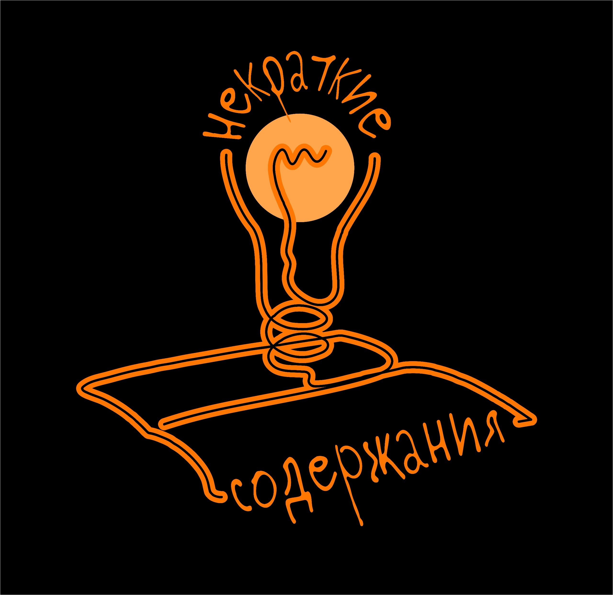

# Некраткие содержания

Некраткие содержания ‒  это неочевидное в прозе и поэзии. Это сам процесс чтения, заметки на полях собраний сочинений или в чертогах разума. 
Здесь говорят о литературе свежо и по-новому, с вниманием к деталям и без штампов.

## Подкаст

1.  [Тютчев и Фет. Разделение сиамских близнецов.](./episode01.html)
2.  [Ни слова о полку Игореве!](./episode02.html)
3.  [Усталость от чтения. Что делать?](./episode03.html)
4.  [Гомер в 2к24. Рили?](./episode04.html)
5.  [Оправдан ли снобизм Набокова?](./episode05.html)
6.  [Автор ничего не хотел сказать.](./episode06.html)
7.  [Скромное обаяние Пелевина.](./episode07.html)
8.  Маяковский, поэт юных.
9.  Что не так с краткими содержаниями? 
10.  Исландский детектив

## Записи в телеграм-канале

[Первые 50 постов](./tg-01.html).

[Последние 40 постов](./tg-02.html).

## Shorts

* [Кому нужен Гомер?](https://www.youtube.com/shorts/_y34fi7x76A)
* [Стихи Тютчева и современников](https://www.youtube.com/shorts/UxnlHN4shKA)
* [Природа в стихах Тютчева и Фета](https://www.youtube.com/shorts/LLdMhBrTASY)
* [Саша Черный и мёд](https://www.youtube.com/shorts/0P_b-LKhwHs)
* [Тютчев и немецкий романтизм](https://www.youtube.com/shorts/qYHAyf7tDQM)
* [Неизмеримость в стихах Тютчева](https://www.youtube.com/shorts/ceFQHBTeI6c)
* [Состарились ли Тютчев и Фет](https://www.youtube.com/shorts/MPYBShNYZno)
* [Видение Тютчева](https://www.youtube.com/shorts/3sMYnQnCuf0)
* [Тютчев и Новалис](https://www.youtube.com/shorts/BF6njF2-530)
* [Влияние Тютчева и Фета](https://www.youtube.com/shorts/JqEgbodQyq4)

## Авторы проекта

[Борис Орехов](https://nevmenandr.github.io/).

[Женя Потапова](https://t.me/zhenya_napishet).

### Лого

