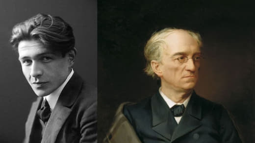
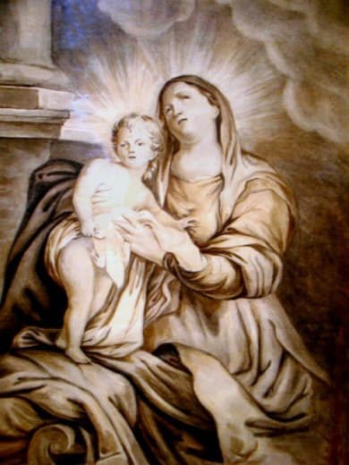
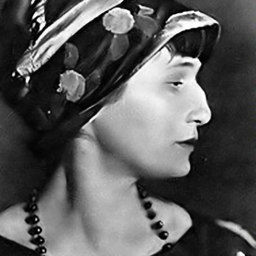
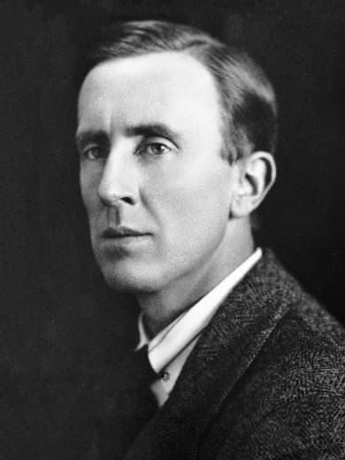
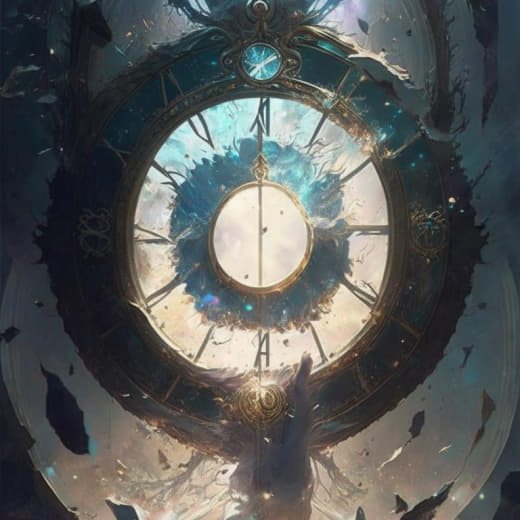
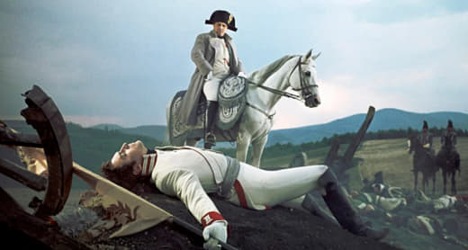
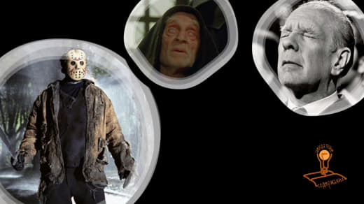

# Некраткие содержания

30 September 2023

12:51

Некраткие содержания

В «Вечере у Клэр» Гайто Газданова есть такой фрагмент:  
  
А когда мои глаза уставали, я закрывал их, и перед моим взглядом как бы захлопывалась дверь; и вот из темноты и глубины рождался подземный шум, которому я внимал, не видя его, не понимая его смысла, стараясь постигнуть и запомнить его. Я слышал в нем и шорох песка, и гул трясущейся земли, и плачущий, ныряющий звук чьего-то стремительного полета, и мотивы гармоник и шарманки.  
  
Идея наполненных непостижимым смыслом звуков откликается на загадочное «Безумие» Тютчева, где мистические звуки приходят оттуда же:  
  
То вспрянет вдруг и, чутким ухом  
Припав к растреснутой земле,  
Чему-то внемлет жадным слухом  
С довольством тайным на челе.  
  
И мнит, что слышит струй кипенье,  
Что слышит ток подземных вод,  
И колыбельное их пенье,  
И шумный из земли исход!  
  
#некраткий\_Тютчев  
#некраткий\_Газданов

Boris Orekhov

3 October 2023

Н

10:34

Некраткие содержания

В рассказе А. П. Чехова «Анна на шее» появляется интересная языковая игра с виной и вином:  
  
Когда поезд тронулся, Аня видела, как ее отец побежал немножко за вагоном, пошатываясь и расплескивая свое вино, и какое у него было жалкое, доброе, виноватое лицо.  
  
#некраткий\_Чехов

Zhenya Potapova

6 October 2023

Н

14:41

Некраткие содержания

Казалось бы, шумиха вокруг нейросетей и вообще искусственного интеллекта, который сокращается от английского “artificial intelligence” до аббревиатуры АИ, началась сравнительно недавно. На деле же Пушкин все уже написал предельно исчерпывающе:  
  
К АИ я больше не способен;  
АИ любовнице подобен  
Блестящей, ветреной, живой,  
И своенравной, и пустой...  
  
#некраткий\_Пушкин

Boris Orekhov

9 October 2023

Н

15:40

Некраткие содержания

У Бена Х. Уинтерса есть книга «Андроид Каренина». Там все как у Толстого, только действующие лица – роботы.  
Так вот, не ту страну назвали Гондурасом. Не тот роман выбрал Уинтерс, ох не тот! Вот в другом романе Льва Николаевича и переделывать надо меньше, дрон уже есть:  
  
«Лет тридцать Богучаровым управлял староста Дрон, которого старый князь звал Дронушкой. (...) Мужики боялись его больше, чем барина. Господа, и старый князь, и молодой, и управляющий уважали его и в шутку называли министром. Во всё время своей службы, Дрон ни разу не был ни пьян, ни болен; никогда, ни после бессонных ночей, ни после каких бы то ни было трудов, не выказывал ни малейшей усталости, и, не зная грамоте, никогда не забывал ни одного счета денег и пудов муки по огромным обозам, которые он продавал, и ни одной копны ужина хлеба на каждой десятине богучаровских полей».  
  
Толстой описывает здесь просто невероятную надежность и отсутствие свойственных человеку пороков. Посмотрим и на внешность: Дрон к 70 годам был «без одного седого волоса или недостатка зуба». Толстой пишет, что такие «мужики» такие же «прямые и сильные в шестьдесят лет, как и в тридцать». Знак качества.  
  
#некраткий\_Толстой

Boris Orekhov

12 October 2023

Н

14:40

Некраткие содержания

В «Освобожденном Иерусалиме» (II, 95):  
  
Одела мир покровом черным ночь;  
И воздух стих, и задремали воды.  
Усталых обитателей лесов,  
Пещер, озер, морей, всю тварь земную  
Сковал отрадный сон; и в тайных недрах,  
Средь ужасов безмолвия и мрака,  
Забыт кипучий день, а с ним забыты  
Все радости, забыты и печали.  
  
Это же буквально «Большая элегия Джону Донну»:  
  
Повсюду ночь: в углах, в глазах, в белье,  
среди бумаг, в столе, в готовой речи,  
в ее словах, в дровах, в щипцах, в угле  
остывшего камина, в каждой вещи.  
(...)  
Спят клены, сосны, грабы, пихты, ель.  
Спят склоны гор, ручьи на склонах, тропы.  
Лисицы, волк. Залез медведь в постель.  
Наносит снег у входов нор сугробы.  
  
#некраткий\_Бродский

Boris Orekhov

15 October 2023

Н

15:40

Некраткие содержания

Мало кто знает, но Лермонтов очень любил обсуждать свои стихи в личных письмах. Например, в 15 лет в письме Марии Шан-Гирей Лермонтов упрекает других в подражании: «Каково вам покажется; Павлов мне подражает, перенимает у... меня! ‒ стало быть... стало быть... ‒ но выводите заключения, какие вам угодно».  
  
NB. Прилагаю вам, милая тетенька, стихи, кои прошу поместить к себе в альбом, а картинку я еще не нарисовал. На вакацию надеюсь исполнить свое обещание.  
  
Когда Рафаэль вдохновенный  
Пречистой девы лик священный  
Живою кистью окончал,-  
Своим искусством восхищенный  
Он пред картиною упал!  
Но скоро сей порыв чудесный  
Слабел в груди его младой,  
И утомленный и немой,  
Он забывал огонь небесный.  
  
Таков поэт: чуть мысль блеснет,  
Как он пером своим прольет  
Всю душу; звуком громкой лиры  
Чарует свет и в тишине  
Поет, забывшись в райском сне,  
Вас, вас! души его кумиры!  
И вдруг хладеет жар ланит,  
Его сердечные волненья  
Все тише, и призрак бежит!  
Но долго, долго он хранит  
Первоначальны впечатленья.  
  
И «картинку» Лермонтов, кстати, нарисовал. Сопоставляя поэта и художника, Лермонтов знал, о чем говорит, ведь был и тем, и другим.  
  
#некраткий\_Лермонтов

Zhenya Potapova

18 October 2023

Н

12:40

Некраткие содержания

А то, что мы называем «уйти по-английски», Толстой называет «на французский манер»:  
  
«Он, закрыв глаза, поклонился, и à la française \[на французский манер\], не прощаясь, стараясь быть незамеченным, вышел из залы».  
  
#некраткий\_Толстой

Boris Orekhov

21 October 2023

Н

12:50

Некраткие содержания

Малоизвестный сонет О. Мандельштама «Христиан Клейст», впоследствии переоформившийся в стихотворение «К немецкой речи», содержит немало вопросов, один из которых ‒ в последнем стихе:  
  
Есть между нами похвала без лести,  
И дружба есть в упор, без фарисейства,  
Поучимся ж серьезности и чести  
У стихотворца Христиана Клейста.  
  
Еще во Франкфурте отцы зевали,  
Еще о Гете не было известий,  
Слагались гимны, кони гарцевали  
И княжества топталися на месте.  
  
Война – как плющ в беседке шоколадной.  
И далека пока еще от Рейна  
Косматая казацкая папаха.  
  
И прямо со страницы альманаха  
Он в бой сошел и умер так же складно,  
Как пел рябину с кружкой мозельвейна.  
  
О какой рябине идет речь, если Клейст, главным образом, следовал традициям воспевания вина и муз? Почему речь не про виноград? Дело в том, что Мандельштам словно стирает грани между немецким и русским языком, ведь в переводе с немецкого der Rebe – виноградная лоза.  
  
#некраткий\_Мандельштам

Zhenya Potapova

24 October 2023

Н

14:40

Некраткие содержания

В фантастическом сериале «Андор» вот так выглядит одно из технических сооружений на планете, где добывают полезные ископаемые. Это ромбокубооктаэдр, возможно, дизайнеры даже вдохновлялись Национальной библиотекой Беларуси в Минске.  
  
#некраткое\_рядом

Boris Orekhov

14:40

Boris Orekhov

27 October 2023

Н

11:40

Некраткие содержания

[😆](stickers/sticker.webp)Многие помнят эпизоды из «Евгения Онегина», в которых Ленский предстает перед читателем как настоящий поэт-романтик, готовый тут же написать «надгробный мадригал» на могиле соседа:  
  
[🙄](stickers/sticker (1).webp) Своим пенатам возвращенный,  
Владимир Ленский посетил  
Соседа памятник смиренный,  
И вздох он пеплу посвятил;  
И долго сердцу грустно было.  
«Рооr Yorick! — молвил он уныло. —  
Он на руках меня держал.  
Как часто в детстве я играл  
Его Очаковской медалью!  
Он Ольгу прочил за меня,  
Он говорил: дождусь ли дня?..»  
И, полный искренней печалью,  
Владимир тут же начертал  
Ему надгробный мадригал.  
  
[😩](stickers/sticker (2).webp) Однако сам текст мадригала в романе в стихах не приводится. Интересно, а как своенравный искусственный интеллект справится с этой задачей, если попросить его так:  
  
[🤖](stickers/AnimatedSticker.tgs) Представь, что ты провинциальный поэт первой трети XIX века. Ты посетил могилу своего соседа, отца твоей возлюбленной. Он был гораздо старше тебя, участвовал в сражении под Очаковом, и получил за это медаль, с которой ты играл в детстве. Его дочь зовут Ольга, он хотел, чтобы она вышла за тебя замуж и задавался вопросом, дождется ли дня, когда вы поженитесь. Ты искренне опечален кончиной твоего соседа. Напиши ему надгробный мадригал.  
  
[🅰️](stickers/AnimatedSticker (1).tgs) Покойся с миром, друг мой старый,  
Ты был мужественным и сильным,  
В сражении ты доказал это,  
За что заслужил медаль свою.  
  
[🔤](stickers/AnimatedSticker (2).tgs) Твоя дочь Ольга теперь одна,  
Она тебя очень любила,  
Ты хотел, чтобы она была моей,  
Но теперь ты ушел на небеса.  
  
[🔤](stickers/AnimatedSticker (3).tgs) Я буду следить за Ольгой,  
Буду заботиться о ней,  
Твоя память будет жить в наших сердцах,  
И мы будем помнить твою доброту и мудрость.  
  
Но чтобы это действительно было похоже на Ленского, можно помочь нейросети и дать образец - стихи персонажа, любезно приведенные самим автором:  
  
Блеснет заутра луч денницы  
И заиграет яркий день;  
А я, быть может, я гробницы  
Сойду в таинственную сень,  
И память юного поэта  
Поглотит медленная Лета,  
Забудет мир меня; но ты  
Придешь ли, дева красоты,  
Слезу пролить над ранней урной  
И думать: он меня любил,  
Он мне единой посвятил  
Рассвет печальный жизни бурной!..  
Сердечный друг, желанный друг,  
Приди, приди: я твой супруг!..  
  
Попросим так: возьми стихи, которые я привожу, за образец и перепиши надгробный мадригал так, чтобы он был похож на эти стихи. Вот что получилось:  
  
Покойся с миром, друг мой дорогой,  
Ты был сильным и мудрым, как ветер.  
Твоя жизнь была полна приключений,  
Ты был настоящим героем.  
  
Ты любил природу и путешествия,  
И творил сам прекрасные рассказы.  
Теперь мы скорбим, но помним о том,  
Что ты оставил после себя яркий след.  
  
Твои друзья и близкие не забудут тебя,  
Ты был для нас светом и вдохновением.  
Покойся с миром, друг мой дорогой,  
Твоя память навсегда останется с нами.  
  
Покойся с миром, друг мой дорогой,  
Ты был силен и мудр, как свежий ветер.  
Исполнен приключений был путь твой.  
  
#некраткий\_Онегин  
#некраткий\_Пушкин

Boris Orekhov

30 October 2023

Н

12:40

Некраткие содержания

Литература сохраняет пространство для фантазии. Кино же сужает его до более узкого коридора конкретной интерпретации, оставаясь при этом заложником своего главного спутника – фотогеничности, которая, приставляя нож к горлу, в очередной раз приказывает использовать то, на что приятно смотреть.  
  
Толстой настойчиво внушает нам, что княжна Марья дурна собой, но как это должно выглядеть, читатель должен вообразить самостоятельно:  
  
Княжна Марья возвратилась в свою комнату с грустным, испуганным выражением, которое редко покидало ее и делало ее некрасивое, болезненное лицо еще более некрасивым и села за свой письменный стол…  
  
[🤥](stickers/sticker (3).webp) Режиссеру это нужно показать. А как? Сыграть некрасивость невозможно. Некрасота субъективна. Показывать некрасоту в кино – против требований самого жанра. Никто не хочет смотреть на настоящую некрасоту. Поэтому и в комиксном «Дэдпуле», например, где нужно показать уродливое лицо, актера Рейнольдса гримируют чуть-чуть, даже не стараясь изобразить уродство.  
  
Все актрисы, играющие княжну Марью, красивы. И Антонина Шуранова, и Джесси Бакли прекрасны. Такие границы задает кино самому себе, а литература свободна.  
  
[😊](stickers/sticker (4).webp) Но дело даже не в том, что в кино обязательно должна быть красота. Голод — лучшая приправа. Фантазия — лучшая косметика. Толстой постоянно подчеркивает красоту Элен («в обществе толстой княгини, его жены, и красавицы Элен»), но... Не то чтобы Таппенс Мидлтон или Ирина Скобцева (жена режиссера, кстати) были как-то по-особенному эффектны или “выигрывали” у актрис, которые играли княжну Марью. То есть хороши, но, кажется, не в том смысле, который имеет в виду Толстой.  
  
#некраткий\_Толстой

Boris Orekhov

2 November 2023

Н

12:00

Некраткие содержания

💡В романсе Пушкина «Не пой, красавица, при мне…» есть такая строфа:  
  
Я призрак милый, роковой,  
Тебя увидев, забываю;  
Но ты поёшь — и предо мной  
Его я вновь воображаю.  
  
В 1851 году Лев Мей пишет «Секстину», последние три стиха которой отражают пушкинский текст:  
  
Опять передо мной явился призрак милый  
И голосок его с неотразимой силой  
Опять, опять звучит в душе моей унылой?  
  
#некраткий\_Мей  
#некраткий\_Пушкин

Zhenya Potapova

5 November 2023

Н

14:40

Некраткие содержания

Ахматова против технического прогресса:  
  
Я давно не верю в телефоны,  
В радио не верю, в телеграф.  
У меня на всё свои законы  
И, быть может, одичалый нрав.  
  
Всякому зато могу присниться,  
И не надо мне лететь на «Ту»,  
Чтобы где попало очутиться,  
Покорить любую высоту.  
  
1959 г.  
  
Еще один писатель с ярко выраженной неприязнью к технике — Толкин. Оба они — современники, свидетели мировых войн, которые стали возможны тоже благодаря прогрессу: «наши изобретения не только не исполняют наших желаний, но обращаются к новому, кошмарному злу».  
  
#некраткая\_Ахматова

Boris Orekhov

14:40

Boris Orekhov

7 November 2023

Н

08:01

Некраткие содержания

💡 История литературы всегда повторяется: первый раз в виде трагедии, второй — в виде постмодернистского романа.  
Альбер Камю, которому сегодня 110 лет, и который и в художественной форме, и в форме философского эссе размышлял, как и зачем человек добровольно уходит из жизни, в «Чуме» дает такую картину неудавшегося самоубийства мсье Коттара: «Он высморкался. На третьем, то есть на самом верхнем, этаже Риэ прочел на двери слева надпись, сделанную красным мелом: “Входите, я повесился”».  
С собой кончает Адриан, персонаж романа Джулиана Барнса «Предчувствие конца»: «Написал письмо коронеру, прикнопил к дверям ванной комнаты записку «Не входить. Вызывайте полицию. Адриан».  
Оба персонажа заботятся о чувствах окружающих, но один предлагает войти, а другой предупреждает от этого. Красный мелок не случайная деталь. Коттар берет его у человека, который учит латынь, и с помощью красного цвета отмечает неизменяемые слова. Красный мел у Камю — застывшая, негибкая, постоянная форма. «Прикнопленная» записка на двери — наоборот, нечто зыбкое и мимолетное.  
  
#некраткий\_Камю

Boris Orekhov

10 November 2023

Н

14:23

Некраткие содержания

#некраткий\_Эко

Boris Orekhov

12 November 2023

Н

10:06

Некраткие содержания

**Как сломать француза**  
  
**💡** Когда Пьер беседует с капитаном Рамбалем в оккупированной Москве, речь неожиданно для последнего [заходит о Париже](https://tolstoy.ru/online/90/11/#backn265):  
[⏪](stickers/sticker (5).webp)Ха — ха — ха!.. А вот сказал штуку.  
— Париж?... Но Париж... Париж...  
— Париж — столица мира...[⏩](stickers/sticker (6).webp)  
  
Последняя фраза произнесена Пьером, а Рамбаль «завис». Он пропустил мимо ушей вопрос Пьера, среагировал на слово «Париж»», на котором ушел в мыслях в другую сторону.  
Почти так же шевалье де Брильи в исполнении М. Боярского в фильме «Гардемарины, вперед!» посреди разговора вдруг переключается в мечтательный режим и вслед за Рамбалем говорит: «О-о-о, Пари!» [🫣](stickers/sticker (7).webp)  
Да, главный рефенс де Брильи, конечно, «Три Мушкетера» (причем, не роман, а отечественная экранизация), но этот штрих со словом-триггером «Париж» мог быть подготовлен Толстым.  
  
#некраткий\_Толстой

Boris Orekhov

13 November 2023

Н

10:21

Некраткие содержания

Boris Orekhov

15 November 2023

Н

10:23

Некраткие содержания

💡 У Эмиля Золя в «Карьере Ругонов» есть предупреждение об эффекте поверхностного знания: «Ничто не действует так вредно на неокрепший ум, как такие обрывки знаний без прочной основы».  
Теперь так работает пульверизация популяризация науки.  
  
Еще более широко формулирует проблему Макс Вебер: «В наши дни мода и литературные склонности породили уверенность, что можно обойтись без специалиста или свести его роль к вспомогательной деятельности на службе “созерцателя”, интуитивно воспринимающего действительность. Почти все науки обязаны кое-чем дилетантам, часто даже весьма ценной постановкой вопросов. Однако возведение дилетантизма в научный принцип было бы концом науки. Пусть тот, кто ищет созерцаний, отправляется в кино».  
  
#некраткий\_Золя

Boris Orekhov

17 November 2023

Н

11:18

Некраткие содержания

💡В романе «Смерть героя» есть расхожая фраза «На Западном фронте без перемен». Текст Олдингтона как раз был опубликован спустя год после книги Ремарка.  
  
[⏪](stickers/sticker (5).webp)Если не считать разговора с лейтенантом Эвансом, Уинтерборн следующие восемь или десять ночей провел в точности так же, как эту. Когда смеркалось, саперы шли на передовую; работали под огнем; дрожали от холода; потом возвращались в тыл, спали, пытались кое-как почиститься и умыться, и вновь строились и шли на работу. Раза четыре-пять по дороге на передовую встречали в окопах носилки с убитыми. Поистине, на Западном фронте все оставалось без перемен.[⏩](stickers/sticker (6).webp)  
  
#некраткий\_Олдингтон

Zhenya Potapova

18 November 2023

Н

10:21

Некраткие содержания

💡 Есть силлабическая система стихосложения. Есть тоническая. Не хватает хтонической. Такой могли быть написаны стихи Лавкрафта [👁](stickers/AnimatedSticker (4).tgs)  
  
[💡](stickers/AnimatedSticker (5).tgs)#некраткое\_стиховедение

Boris Orekhov

20 November 2023

Н

11:18

Некраткие содержания

💡 [⏪](stickers/sticker (5).webp)Славное село Целебеево, подгородное; средь холмов оно да лугов; туда, сюда раскидалось домишками, прибранными богато, <…> а то и смородинным кустом, и целым роем скворечников, торчащих в заре на согнутых метлах своих: славное село.webp)  
  
Можно подумать, что это Гоголь. Но это Андрей Белый. А Гоголь вот:  
  
[⏪](stickers/sticker (8).webp)Я бы изобразил, как спит весь Миргород; как неподвижно глядят на него бесчисленные звезды; как видимая тишина оглашается близким и далеким лаем собак; как мимо их несется влюбленный пономарь и перелазит чрез плетень с рыцарскою бесстрашностию.[⏩](stickers/sticker (9).webp)  
  
#некраткий\_Гоголь  
#некраткий\_Белый

Zhenya Potapova

21 November 2023

Н

10:14

Некраткие содержания

**💡** В «Истории кавалера де Гриё и Манон Леско» есть трогательный эвфемизм: «Мы стали супругами». Речь не о законном браке, а о том самом.  
[💋](stickers/sticker (10).webp) Трогательность же в том, что ту же самую метафору потом подметили Вайль и Генис для чопорного оттепельного кинематографа:  
[💋](stickers/sticker (11).webp)“Ты сказала, что мы с тобой… ну… решили пожениться?” Это означало, что персонажи спят друг с другом, а брак тут ни при чем, но речевой этикет часто отстает от реалий жизни [💋](stickers/sticker (12).webp) («Оттепель»)  
  
#некраткий\_Прево

Boris Orekhov

23 November 2023

Н

11:19

Некраткие содержания

💡 В «Мцыри» герой описывает схватку с барсом так:  
  
Но в горло я успел воткнуть  
И там два раза повернуть  
Мое оружье... Он завыл,  
Рванулся из последних сил…  
  
В поэме «Тазит» А. С. Пушкина, опубликованной в «Современнике» под заглавием «Галуб», отец главного героя, желающий видеть в сыне «храброго чеченца», спрашивает у него про схватку с кровным врагом семьи:  
  
Врага ты навзничь опрокинул,  
Не правда ли? ты шашку вынул,  
Ты в горло сталь ему воткнул  
И трижды тихо повернул…  
  
[💡](stickers/AnimatedSticker (5).tgs) #некраткий\_Пушкин  
[💡](stickers/AnimatedSticker (5).tgs) #некраткий\_Лермонтов

Zhenya Potapova

24 November 2023

Н

11:10

Некраткие содержания

**💡** Продолжаем испытывать искусственный интеллект, который призван дописывать утраченные тексты. [🖥](stickers/sticker (13).webp) Сегодня ChatGPT пишет за Аристотеля.  
  
[🫤](stickers/sticker (14).webp) Представь, что ты древнегреческий философ. Ты уже написал книгу о том, как устроено литературное произведение. Мы называем эту книгу «Поэтика», она посвящёна теории трагедии.  
Теперь ты пишешь вторую часть этой книги, она будет посвящена комедии. В следующем абзаце приводится начало этой книги. Продолжи ее в том же стиле.  
  
[😬](stickers/sticker (15).webp) Образец берем из романа Умберто Эко «Имя розы»:  
В первой части мы говорили о трагедии, как она посредством сострадания и страха совершает очищение подобных страстей. Теперь же, как обещано, скажем о комедии...  
  
Вот как выглядело продолжение второй части «Поэтики» от искусственного интеллекта:  
  
[🧠](stickers/AnimatedSticker (6).tgs) Кроме того, мы рассмотрим персонажей в комедии и их роль в мимесисе. В отличие от трагедии, комедия не требует изображения героических персонажей, а скорее обычных людей со своими недостатками и глупостями. Эти персонажи часто преувеличены или карикатурны, чтобы создать больший эффект нелепости. Мы также обсудим важность хора в комедии, который служит не только комментарием к действию, но и средством усиления комического эффекта.  
Наконец, мы исследуем моральные и социальные последствия комедии. В то время как трагедия часто затрагивает серьезные вопросы, такие как судьба и мораль, комедия часто рассматривается как более легкий жанр. Однако это не означает, что он не имеет своих собственных моральных и социальных особенностей. Через изображение несовершенных персонажей и их забавных приключений комедия может предложить критику общества и его ценностей.  
В этой книге мы погрузимся в тонкости комедии и ее роль в греческой литературе и обществе. Мы увидим, как она предлагает другую перспективу человеческой природы и обеспечивает необходимый выход из жизненных проблем. Через наш анализ мы надеемся получить более глубокое понимание этого любимого жанра и его неизменной привлекательности.  
Мы также рассмотрим, как комедия эволюционировала со временем, начиная с ее ранних истоков в произведениях Аристофана и до более изысканных и тонких комедий Менандра и его современников. Мы увидим, как меняющийся политический и социальный ландшафт Греции влиял на развитие комедии и как она отражала заботы и отношения людей.  
Кроме того, мы исследуем аспекты выступления в комедии, включая использование масок, костюмов и музыки. Мы рассмотрим, как эти элементы использовались для усиления комического эффекта и создания запоминающегося опыта для аудитории.  
На протяжении всей книги мы будем использовать примеры из различных греческих комедий, включая произведения Аристофана, Менандра и других. Мы проанализируем ключевые сцены и персонажей, и исследуем темы и сообщения, которые они передают.  
В заключение, эта книга стремится предоставить всестороннее исследование греческой комедии, от ее истоков до ее неизменного наследия. Рассматривая ее персонажей, темы и аспекты выступления, мы надеемся предложить более глубокое понимание этого любимого жанра и его места в древнегреческом обществе и литературе.  
  
#некраткий\_Эко

Boris Orekhov

26 November 2023

Н

11:12

Некраткие содержания

💡В романе Олдингтона «Смерть героя» один эпизод перекликается с небом Аустерлица князя Андрея. Может быть, это даже сознательно: Толстой ведь повлиял на западную баталистику. [📕](stickers/sticker (16).webp)  
  
[⏪](stickers/sticker (5).webp) Прежде он не знал, что от холода и сырости так долго, мучительно болят и нипочем они не согреваются ноги. Не знал, как трудно, сгибаясь под тяжелой ношей, брести по густой, глубокой меловой каше, какого усилия требует каждый шаг, как засасывает грязь одну ногу, пока удается вытащить другую. Не знал, что можно так ненавидеть неживую, косную материю. Над головою могло сиять солнце, голубело неяркое мартовское небо, все в пушистых белых клубках шрапнельных разрывов, и от них стремительно ускользал в вышине крохотный серебристый аэроплан. Под ногами была грязь. Солдатам некогда было смотреть на небо – согнувшись, едва волоча ноги, они брели по затопленным грязью траншеям.[⏩](stickers/sticker (6).webp)  
  
#некраткий\_Олдингтон

Zhenya Potapova

27 November 2023

Н

19:01

Некраткие содержания

«Некраткие содержания» сосредоточены на текстах. Иногда, в особых случаях, когда не ясно, кто кому подражает, литература жизни или наоборот, мы можем позволить себе взглянуть на то, что происходит «за чертой страницы». [📕](stickers/sticker (17).webp)  
И это редкость. Так почти не бывает. Почти все почти всегда говорят о биографии писателя, об историческом контексте. Нам кажется, что это странно. Колонка Бориса Орехова с размышлениями на эту тему по [ссылке](https://schola.hse.ru/news/874663585.html).

Boris Orekhov

29 November 2023

Н

10:42

Некраткие содержания

💡 Кое-где «Евгения Онегина» можно осовременить: [✏️](stickers/AnimatedSticker (7).tgs)  
  
Мелькают профили голов  
И дам и модных чуваков.  
  
[🤍](stickers/AnimatedSticker (8).tgs)[🤍](stickers/AnimatedSticker (9).tgs)[🤍](stickers/AnimatedSticker (10).tgs)[🤍](stickers/AnimatedSticker (11).tgs)[🤍](stickers/AnimatedSticker (12).tgs)  
  
#некраткий\_Онегин

Boris Orekhov

30 November 2023

Н

15:36

Некраткие содержания

«[Некраткие содержания](https://t.me/nonbrevia)» умеют читать литературу и поэтому умеют находить величие в малом, и вообще знают, что настоящие жемчужины есть не только в Верхнем Интернете.  
Делимся с вами нашим списком любимых телеграм-каналов до 1000 подписчиков. Иногда мы шутим про литературу. Но тут все всерьез. Всерьез мы тоже умеем.  
  
**THALATTA ΘΑΛΑΣΣΑ** [https://t.me/thalatta\_thalassa](https://t.me/thalatta_thalassa) О соприкосновении античной культуры и современного взгляда, готового удивляться и радоваться удивлению. Греческая метрика в картинках и одежда скифского лучника как пижама  
  
**EZH** [https://t.me/ezhetta](https://t.me/ezhetta) Будни университетского администратора и человека с кошкой. Бытовые зарисовки, которые хочется читать и перечитывать 🦔  
  
**Ассоциативное чтение** [https://t.me/associativereading](https://t.me/associativereading) Близкий нам по настрою канал человека, который ходит в библиотеку, читает книги и рассказывает об этом 📚  
  
**Нурия и** н... [https://t.me/catflat](https://t.me/catflat) Канал врача-терапевта и копирайтера, которая решила повысить квалификацию и превратиться в психиатра. Забавные и грустные, но живые заметки и наблюдения из настоящего психоневрологического диспансера 💊  
  
**Vales and mountains** [https://t.me/Valesandmountains](https://t.me/Valesandmountains) Красота. Просто красота каждый день. Ну или почти каждый 🖼️  
  
**From AustRussian with Love** [https://t.me/abraxx\_au](https://t.me/abraxx_au) Про жизнь русского в Австралии. Нашими глазами на их быт и порядки 🇦🇺  
  
**сегодня я нашла в НКРЯ** [https://t.me/ruscorpora\_is\_fun](https://t.me/ruscorpora_is_fun) Про слова, о которых много чего можно узнать, если искать в Национальном корпусе русского языка. Сюжеты бывают захватывающие, не хуже литературных. Слово "чуингам", наивная мудрость пива, портреты, нарисованные буквами. А вот, кстати, и канал самого корпуса: [https://t.me/ruscorpora](https://t.me/ruscorpora) (там почему-то тоже пока нет 1000)  
  
**строчкой** [https://t.me/letsfixuntilitsgone](https://t.me/letsfixuntilitsgone) текст из одной строки  
  
**Девушка с жемчужной обидомэ** [https://t.me/pearl\_obidome](https://t.me/pearl_obidome) Камерный канал об искусстве и истории костюма. Национальные мотивы в одежде аристократов, современная иранская скульптура и все-все-все  
  
**Ревизская сказочница** [https://t.me/economhistory](https://t.me/economhistory) Всем интересно про историю. Автор канала смотрит на историю через призму экономики. И получается не всегда так, как мы привыкли. Когда люди в России стали жить лучше? Как вел хозяйство Державин?  
  
«[Некраткие содержания](https://t.me/nonbrevia)» [https://t.me/nonbrevia](https://t.me/nonbrevia) Про литературу. Так, как вы про нее раньше нигде не читали. С вниманием к деталям, без штампов и биографий, о том, как тексты говорят друг с другом.

Boris Orekhov

1 December 2023

Н

09:01

Некраткие содержания

💡 Счастливые совпадения имен и званий в «Будденброки»:  
  
[⏪](stickers/sticker (5).webp)В средних классах преподавал латынь некий долговязый господин с русыми бакенбардами и живыми блестящими глазами, по фамилии Пастор, ранее и вправду бывший пастором, который не переставал радоваться совпадению своей фамилии со своим духовным званием.[⏩](stickers/sticker (6).webp)  
  
В «Уловке 22» тоже:  
  
[⏪](stickers/sticker (8).webp)Второй проделкой судьбы было наречение младенца с фамилией Майор именем Майор. Это была тайна, известная лишь его отцу. Тайна раскрылась, когда ребенка привели записывать в детский сад. Эффект был катастрофическим. Новость убила мать. Узнав, как зовут ее дитя, она утратила интерес к жизни, зачахла и скончалась. <...> А произвела Майора Майора в майоры электронная счетно-решающая машина, обладающая почти таким же тонким чувством юмора, как и папаша Майора Майора. Когда разразилась война. <...> С наступлением дня над проблемой майора Майора принялись размышлять офицеры. Как им следовало относиться к такому майору, как майор Майор? Обращаться с ним, как с низшим чином, – значило бы унизить всех остальных майоров, а также офицеров ниже рангом. С другой стороны, относиться к нему вежливо было тоже немыслимо.[⏩](stickers/sticker (9).webp)  
  
#некраткий\_Манн  
#некраткий\_Хеллер

Boris Orekhov

2 December 2023

Н

16:05

Некраткие содержания

Авторы «Некратких содержаний» ‒ Борис Орехов и Женя Потапова. Они филологи. Но что кроется за этим словом? Что это за профессия и профессия ли? Чему их учили в университете и актуальна ли эта специальность? У подкаста «Профессии будущего» вышел выпуск, посвященный филологии, в нем Борис Орехов предполагает, какие ответы на эти вопросы могут быть.  
Рекомендуем послушать. Возможно, после этого наш подход к тексту как к самоценному феномену станет вам еще ближе.  
[https://www.youtube.com/watch?v=mY8UDn4tAP0](https://www.youtube.com/watch?v=mY8UDn4tAP0)  
  
[🎵](stickers/AnimatedSticker (13).tgs) на [Яндекс.Музыке](https://music.yandex.ru/album/25890112/track/118340156)  
[🍏](stickers/AnimatedSticker (14).tgs) на [Apple Podcasts](https://podcasts.apple.com/dk/podcast/%D1%84%D0%B8%D0%BB%D0%BE%D0%BB%D0%BE%D0%B3%D0%B8%D1%8F-%D0%B2-%D1%8D%D0%BF%D0%BE%D1%85%D1%83-%D0%B8%D1%81%D0%BA%D1%83%D1%81%D1%81%D1%82%D0%B2%D0%B5%D0%BD%D0%BD%D0%BE%D0%B3%D0%BE-%D0%B8%D0%BD%D1%82%D0%B5%D0%BB%D0%BB%D0%B5%D0%BA%D1%82%D0%B0-%D1%87%D1%82%D0%BE-%D0%B6%D0%B4%D1%91%D1%82/id1688691376?i=1000631462177)  
[🌐](stickers/AnimatedSticker (15).tgs) в [VK](https://vk.com/podcast-72341022_456239034)

Zhenya Potapova

3 December 2023

Н

09:03

Некраткие содержания

💡«Кончик языка совершает путь вниз по небу, чтобы на третьем толкнуться о зубы» — искушенному читателю не требуется продолжение, чтобы понять, что речь идет о набоковском Ло. Ли. Та.  
  
[🌐](stickers/AnimatedSticker (16).tgs) Но что будет, если заменить согласные этих трех шагов? У Умберто Эко получилось так:  
  
[💋](stickers/sticker (11).webp)Нонита. Цвет юности моей, тоска ночей. Я никогда не увижу тебя. Нонита. Но-ни-та. Три слога как сотканное из нежности отрицание: Но. Ни. Та. Нонита, да пребудет память о тебе вечно со мной, пока не станет твой образ тьмой, а покоем твоим — гробница.[💋](stickers/sticker (12).webp)  
  
[🤔](video_files/sticker.webm) Наш вариант:  
  
[⏪](stickers/sticker (5).webp)[Эр-га-тив](https://ru.wikipedia.org/wiki/%D0%AD%D1%80%D0%B3%D0%B0%D1%82%D0%B8%D0%B2). Кончик языка совершает путь в три шажка сначала вдаль от зубов, затем на третьем толкается о зубы и замирает в смиренном ожидании, пока нижняя губа и резцы решают свой спор между собою. Эр. Га. Тив.[⏩](stickers/sticker (6).webp)  
  
#некраткий\_Набоков  
#некраткий\_Эко

Boris Orekhov

4 December 2023

Н

17:44

Некраткие содержания

[

01:23

](video_files/Некраткие_видео.mp4)

Недавно мы писали про подкаст. Теперь мы решили сделать свой, чтобы говорить о литературе так, как мы умеем.  
  
Вот трейлер нашего подкаста с невероятной красоты видеорядом, которой хотим с вами поделиться.  
  
Будем рады вашим реакциям!  
  
[https://www.youtube.com/watch?v=fsEMIJvqNek](https://www.youtube.com/watch?v=fsEMIJvqNek)

Zhenya Potapova

5 December 2023

Н

09:57

Некраткие содержания

💡 В день 220-летия Тютчева напомним, какие современные (иногда шикарные) иллюстрации к его стихам [нарисовал](https://nevmenandr.github.io/tiutchev-kandisky/) искусственный интеллект [🖥](stickers/sticker (13).webp)  
  
[🤍](stickers/AnimatedSticker (17).tgs)[🤍](stickers/AnimatedSticker (18).tgs)[🤍](stickers/AnimatedSticker (19).tgs)[🤍](stickers/AnimatedSticker (20).tgs)  
  
#некраткий\_Тютчев

Boris Orekhov

09:57

Boris Orekhov

09:57

Boris Orekhov

09:57

Boris Orekhov

6 December 2023

Н

14:47

Некраткие содержания

Перед нами иллюстрация к стихотворению О. Мандельштама.  
  
Notre Dame  
  
Где римский судия судил чужой народ,  
Стоит базилика, и — радостный и первый —  
Как некогда Адам, распластывая нервы,  
Играет мышцами крестовый легкий свод.  
  
Но выдает себя снаружи тайный план,  
Здесь позаботилась подпружных арок сила,  
Чтоб масса грузная стены не сокрушила,  
И свода дерзкого бездействует таран.  
  
Стихийный лабиринт, непостижимый лес,  
Души готической рассудочная пропасть,  
Египетская мощь и христианства робость,  
С тростинкой рядом — дуб, и всюду царь — отвес.  
  
Но чем внимательней, твердыня Notre Dame,  
Я изучал твои чудовищные ребра, —  
Тем чаще думал я: из тяжести недоброй  
И я когда-нибудь прекрасное создам…  
  
Это текст, который довольно легко пересказать и понять, посвящен описанию готического собора и завершается надеждой лирического героя на то, что и он однажды создаст что-то прекрасное. Более того – стихотворение перед нами уже свидетельствует о том, что ему это удается. Он у нас на глазах создает прекрасное из «тяжести» слов.  
М. Л. Гаспаров будет писать, что это «гимн организации, культуре, преодолевающей природу». Здесь организация храма, которая так подробно описывается в терминах («крестовый свод», «подпружные арки» и т. д.), как бы противопоставлена природной силе. Более того – рукотворный храм у него подобен «непостижимому лесу». Не природа – храм (как у символистов), а наоборот.  
  
Это текст с канала [📱](video_files/sticker (1).webm) «[Лошадь Волошина](https://t.me/loshadvoloshina)». Там вы можете найти много интересных интерпретаций классических текстов в живописи, кино и других видах искусства.  
  
#некраткий\_Мандельштам

Zhenya Potapova

7 December 2023

Н

10:49

Некраткие содержания

[💡](stickers/sticker (18).webp) В рассказе Чехова «Скверная история» есть забавная пародия на поэзию Фета. Если вы не знали, как передать принципы «чистого искусства» в прозе, то вот:  
  

> Был тихий вечер. В воздухе пахло. Соловей пел во всю ивановскую. Деревья шептались. В воздухе, выражаясь длинным языком российских беллетристов, висела нега... Луна, разумеется, тоже была. Для полноты райской поэзии не хватало только г. Фета, который, стоя за кустом, во всеуслышание читал бы свои пленительные стихи.

  
  
  
#некраткий\_Фет  
#некраткий\_Чехов

Zhenya Potapova

9 December 2023

Н

10:11

Некраткие содержания

💡 В письмо к Марии Лопухиной Лермонтов вписал знаменитое стихотворение «Парус». [✉️](stickers/sticker (19).webp)  
Его комментарий не менее интересен:  
  
[⏪](stickers/sticker (5).webp)Стоит ли человеческая мысль, как бы значительна она ни была, вещественного закрепления только ради того, чтобы стать понятной нескольким душам; надо полагать, что люди вовсе не созданы мыслить, потому что мысль сильная и свободная — такая для них редкость!  
Я поставил себе целью засыпать вас своими письмами и стихами; это не очень по-дружески и даже не человеколюбиво, но каждый должен следовать своему предназначению.  
  
Вот еще стихи, которые я сочинил на берегу моря:  
  
Белеет парус одинокой  
В тумане моря голубом. —  
Что ищет он в стране далекой?  
Что кинул он в краю родном?  
  
Играют волны, ветер свищет,  
И мачта гнется и скрыпит;  
Увы! — он счастия не ищет,  
И не от счастия бежит! —  
  
Струя под ним светлей лазури,  
Над ним луч солнца золотой: —  
А он, мятежный, просит бури,  
Как будто в бурях есть покой.webp)  
[💌](stickers/sticker (20).webp)  
  
#некраткий\_Лермонтов

Zhenya Potapova

11 December 2023

Н

13:09

Некраткие содержания

💡 Версия: князь Андрей погиб в битве при Аустерлице. Весь последующий роман — его предсмертное видение.  
  
[⚫️](stickers/AnimatedSticker (21).tgs)  
  
#некраткий\_Толстой

Boris Orekhov

14 December 2023

Н

10:28

Некраткие содержания

**💡** Продолжаем тестировать искусственный интеллект. [🧠](stickers/AnimatedSticker (6).tgs)  
На этот раз ChatGPT должен был закончить роман Новалиса «Генрих фон Офтердинген» [🤥](stickers/sticker (3).webp). Мы рассказали ему историю Генриха, который увидел во сне голубой цветок [🌸](stickers/sticker (21).webp), пообщался с купцами и рудокопом, встретил и потерял свою возлюбленную Матильду. Вот как ИИ предложил завершить историю:  
  
[🖥](stickers/sticker (13).webp) Пока Генрих продолжал свое путешествие через горы, он почувствовал глубокую тоску по Матильде, своей возлюбленной невесте, которая трагически скончалась. Он бродил бесцельно, чувствуя себя потерянным и отчаянным без нее рядом. Именно в это время отчаяния он снова встретил Сильвестра. Слова мудрости и напутствия Сильвестра помогли Генриху обрести утешение и ясность в своей скорби.  
Под вдохновением Сильвестра, Генрих нашел силы вернуться в свой родной город, где воссоединился с Клингсором, поэтом, дочь которого Матильда была его настоящей любовью. Клингсор приветствовал Генриха с распростертыми объятиями, понимая глубину его скорби и бесконечную любовь, которую он испытывал к Матильде. Вместе они нашли утешение в своих общих воспоминаниях о ней.  
В компании этих дорогих друзей Генрих нашел новое вдохновение для своей поэзии и искусства. Он направил свои эмоции в свою работу, создавая шедевры, которые захватывали суть любви, потери и вечной связи между душами. Его творения нашли отклик у людей из всех слоев общества, трогая их сердца и души своей трансцендентной красотой.  
Через свое искусство Генрих увековечил память о Матильде и глубоком влиянии, которое она оказала на его жизнь. Его стихи и картины стали свидетельством бесконечной силы любви и взаимосвязи всех существ. Таким образом, он нашел исцеление и цель в своей скорби, преобразуя свою боль в наследие красоты и мудрости.  
В конце концов путешествие Генриха привело его к пониманию и принятию вечного танца любви, который объединяет все души. И оглядываясь на свою жизнь, он знал, что выполнил свою судьбу как поэт и художник, оставив наследие, которое будет длиться много поколений. А тайна голубого цветка из его сна была окончательно разгадана - это был символ вечной любви, преодолевающей время и пространство.  
  
[🤍](stickers/AnimatedSticker (22).tgs)[🤍](stickers/AnimatedSticker (23).tgs)[🤍](stickers/AnimatedSticker (24).tgs)[🤍](stickers/AnimatedSticker (25).tgs)[🤍](stickers/AnimatedSticker (26).tgs)[🤍](stickers/AnimatedSticker (27).tgs)[🤍](stickers/AnimatedSticker (28).tgs)[🤍](stickers/AnimatedSticker (29).tgs)  
  
Честно говоря, очень скучно. У Людвига Тика получилось гораздо лучше.  
  
#некраткий\_Новалис

Boris Orekhov

17 December 2023

Н

10:25

Некраткие содержания

💡Многие слышали про лермонтовскую «Казачью колыбельную песню». Она задала образец, после нее такой ритмический рисунок сопровождает колыбельные.  
  
[📖](stickers/sticker (22).webp) Лермонтов:  
  
[⏪](stickers/sticker (8).webp)Спи, младенец мой прекрасный,  
‎Баюшки-баю.  
Тихо смотрит месяц ясный  
‎В колыбель твою.  
Стану сказывать я сказки,  
‎Песенку спою;  
Ты ж дремли, закрывши глазки,  
‎Баюшки-баю.[⏩](stickers/sticker (9).webp)  
  
[📚](stickers/sticker (23).webp) Ахматова:  
  
[💋](stickers/sticker (24).webp)Младший сын был ростом с пальчик, –  
Как тебя унять,  
Спи, мой тихий, спи, мой мальчик,  
Я дурная мать.[💋](stickers/sticker (25).webp)  
  
[\*️⃣](stickers/sticker (26).webp)(Четырёхстопный хорей с женским окончанием + трёхстопный хорей с мужским)  
  
#некраткое\_стиховедение  
#некраткий\_Лермонтов  
#некраткая\_Ахматова

Zhenya Potapova

20 December 2023

Н

11:30

Некраткие содержания

💡У Л. Н. Толстого в «Воскресении» и «Хаджи-Мурате» есть примечательное описание «бараньих глаз». Любопытно, что в романе они принадлежат «красивой девушке» Марье Павловне, а в повести ‒ воспитаннику главного героя:  
  
[⏪](stickers/sticker (8).webp)Элдар сел, скрестив ноги, и молча уставился своими красивыми бараньими глазами на лицо разговорившегося старика. Старик рассказывал, как ихние молодцы на прошлой неделе поймали двух солдат: одного убили, а другого послали в Ведено к Шамилю. Хаджи-Мурат рассеянно слушал, поглядывая на дверь и прислушиваясь к наружным звукам. Под навесом перед саклей послышались шаги, дверь скрипнула, и вошел хозяин.[⏩](stickers/sticker (9).webp)  
  
[⏪](stickers/sticker (5).webp)Марья Павловна, та самая красивая девушка с бараньими глазами, которая обратила внимание Нехлюдова, встала во весь свой высокий рост и сильной, широкой, почти мужской походкой подошла к Нехлюдову и мальчику.[⏩](stickers/sticker (6).webp)  
  
Толстой невероятно внимателен к [🖼](stickers/sticker (27).webp) портретным чертам персонажей, они навязчиво сопровождают героя, как, например, голые плечи Элен в «Войне и мире». Именно у Марьи Павловны и Элдара настойчиво подчеркиваются бараньи глаза, больше ни у кого в текстах Толстого таких нет.  
  
#некраткий\_Толстой

Zhenya Potapova

23 December 2023

Н

11:31

Некраткие содержания

💡Как забавно иногда может изменяться перевод! «Трое в лодке» Джерома К. Джерома:  
  
[⏪](stickers/sticker (5).webp)Мне захотелось узнать, чем я еще болен. Я прочитал о пляске святого Витта и узнал, как и следовало ожидать, что болен этой болезнью. Заинтересовавшись своим состоянием, я решил исследовать его основательно и стал читать в алфавитном порядке. Я прочитал про атаксию и узнал, что недавно заболел ею и что острый период наступит недели через две. Брайтовой болезнью я страдал, к счастью, в легкой форме и, следовательно, мог еще прожить многие годы. У меня был дифтерит с серьезными осложнениями, а холерой я, по видимому, болен с раннего детства.  
  
Я добросовестно проработал все двадцать шесть букв алфавита и убедился, что единственная болезнь, которой у меня нет, - это воспаление коленной чашечки. Сначала я немного огорчился - это показалось мне незаслуженной обидой. Почему у меня нет воспаления коленной чашечки? Чем объяснить такую несправедливость?[⏩](stickers/sticker (6).webp)  
  
В другом переводе комический эффект более явный:  
  
[⏪](stickers/sticker (8).webp)Так я добросовестно перебрал все буквы алфавита, и единственная болезнь, которой я у себя не обнаружил, была родильная горячка.  
  
Вначале я даже обиделся: в этом было что-то оскорбительное. С чего это вдруг у меня нет родильной горячки? С чего это вдруг я ею обойден?[⏩](stickers/sticker (9).webp)  
  
[📎](stickers/sticker (28).webp) Вот так родильная горячка и воспаление коленной чашечки стали взаимозаменяемыми. Хотя даже в переводе можно заметить закономерность: атаксия – _a_, брайтовая болезнь – _b_, холера – _c_, а родильная горячка – _d_ (_delirium_), в отличие от воспаления (_inflammation_). Горячка с точки зрения алфавитного порядка выглядит органичнее.  
  
#некраткий\_Джером

Zhenya Potapova

26 December 2023

Н

10:06

Некраткие содержания

«Лавр» Водолазкина рисует житие христианского праведника Арсения, который научается искусству врачевать у своего деда. В «Pasternak» Елизарова наоборот, дед учит своего внука языческой магии [💀](stickers/sticker (29).webp), врагами которой выступают злые попы.  
  
Соблазнительно было бы считать, что Елизаров пародийно переворачивает «Лавр», как он поступает и с другими культурными стереотипами. Вот только «Pasternak» написан за десять лет до романа Водолазкина.  
  
#некраткий\_Елизаров

Boris Orekhov

29 December 2023

Н

12:12

Некраткие содержания

💡 Версия: [🤨](stickers/AnimatedSticker (30).tgs) Джейсон Вурхиз и Хорхе Борхес — одно лицо. Чтобы его не узнали, аргентинский писатель надевал маску, когда наводил шороху в американской глубинке. ☠️  
  
Обо всем догадался только Умберто Эко, который изобразил Борхеса в «Имени розы» жестоким убийцей. Но никто не понял, что на самом деле имел в виду Эко.  
  
#некраткий\_Эко

Boris Orekhov

31 December 2023

Н

16:02

Некраткие содержания

Новогоднее настроение в коридорах Института русской литературы

Boris Orekhov

1 January 2024

Н

12:28

Некраткие содержания

Данте Габриэль Россети

Boris Orekhov

3 January 2024

Н

10:04

Некраткие содержания

**Понасенков и Толстой**  
  
Евгений Понасенков\* (иноагент), написавший большую книгу о войне 1812 года, смотрит на это событие, преклоняясь перед фигурой Наполеона. Публицист объявляет всех, кто имеет к французскому императору хотя бы какие-то претензии, завистниками или глупцами. Там много пассажей вроде «ущербная душонка Александра I».  
  
Одним из самых значительных критиков Наполеона при этом является Толстой, который изображает его в «Войне и мире» человеком поверхностным, недалеким, для которого самолюбование важнее любых государственных соображений. Но главное — Толстой утверждает, что Наполеон не сделал ничего великого, наоборот, императором управляет история.  
  
Понасенков мог «не заметить» критики своего кумира. В конце концов, «Война и мир» — это роман, а не исторический источник. Понасенков мог объявить Толстого недостойным внимания ничтожеством, как он поступил с длинным рядом других авторов и исторических фигур. Но почему-то на это публицист не решился. Он сделал иначе.  
  
В массивной монографии о войне 1812 года Понасенков, признавая художественный талант Толстого, предлагает читать все, что тот написал, наоборот: «подразумевая смысл прямо противоположный написанному». То есть видеть в том, что Толстой называл черным, белое, а в Наполеоне — величие и могущество.  
  
Иронично, что на одном из стримов автор отсылает зрителя, задавшего вопрос о Толстом, к своей книге, и может создаться впечатление, что Понасенков посвящает писателю значительное место. Отнюдь. Это всего лишь один разворот, две страницы (158 и 159) из почти девятисот.  
  
Как публицист проворачивает этот фокус? Он ловит Толстого на противоречиях. Цитируя дневники писателя, Понасенков намекает на скрытое влечение Толстого к мужчинам, дополняя эти намеки тем, что писатель склонен был чувствовать неприязнь к тем, кого любил. Поэтому будто бы его тексты нужно читать как рукописи Леонардо да Винчи, поставив перед ними зеркало.  
  
Нина Берберова в автобиографической книге «Курсив мой» обращается к той же цитате из дневника Толстого, но, в отличие от Понасенкова, приводит ее целиком: «Я никогда не был влюблен в женщин. (Ему в это время было 23 года.) В мужчин я очень часто влюблялся. Я влюблялся в мужчин, прежде чем иметь понятие о возможности педерастии (подчеркнуто Толстым); но и узнавши, никогда мысль о возможности соития не входила мне в голову». Мастер-класс по манипуляции от Понасенкова: он обрывает эту цитату после второго предложения.  
  
Кстати, Понасенков и Толстой стоят друг друга в том, как подать читателю оппонента. Толстой о Наполеоне:  
  
[⏪](stickers/sticker (8).webp)Вся его потолстевшая, короткая фигура с широкими толстыми плечами и невольно выставленным вперед животом и грудью имела тот представительный, осанистый вид, который имеют в холе живущие сорокалетние люди [⏩](stickers/sticker (9).webp)  
  
Понасенков об Александре:  
  
[⏪](stickers/sticker (5).webp)Примерно уже в 40 лет у русского монарха начался процесс отложения жира — и в самых, так сказать, неудачных для мужчины местах [⏩](stickers/sticker (6).webp)  
  
Главная загадка в другом: почему Понасенков не решился на развенчание Толстого? Публицист любит дорогие и красивые вещи, европейскую культуру и искусство. Видимо, место Толстого в западном каноне дает русскому писателю охранную грамоту.  
  
#некраткий\_Толстой

Boris Orekhov

6 January 2024

Н

10:59

Некраткие содержания

💡 Реклама KFC в «Антоновских яблоках»: [🍔](stickers/AnimatedSticker (31).tgs)  
  
[⏪](stickers/sticker (8).webp)Взовьется откуда-нибудь ястребок в прозрачном воздухе и замрет на одном месте, трепеща острыми крылышками[⏩](stickers/sticker (9).webp)  
  
#некраткий\_Бунин

Boris Orekhov

9 January 2024

Н

11:02

Некраткие содержания

💡 В «Педагогической поэме» А. С. Макаренко уже задумывался о «русской идее» задолго до Вовчика Малого из «Generation “П”»:  
  
[⏪](stickers/sticker (5).webp)Если перед коллективом нет цели, то нельзя найти способа его организации[⏩](stickers/sticker (6).webp)  
  
[У Пелевина](https://www.youtube.com/watch?v=yj4hxehkP4Y):  
  
[⏪](stickers/sticker (8).webp)Задача простая, – сказал Вовчик. – Напиши мне русскую идею размером примерно страниц на пять. И короткую версию на страницу. Чтоб чисто реально было изложено, без зауми. И чтобы я любого импортного пидора – бизнесмена там, певицу или кого угодно – мог по ней развести. Чтоб они не думали, что мы тут в России просто денег украли и стальную дверь поставили. Чтобы такую духовность чувствовали, бляди, как в сорок пятом под Сталинградом, понял?[⏩](stickers/sticker (9).webp)  
  
#некраткий\_Пелевин

Boris Orekhov

12 January 2024

Н

11:51

Некраткие содержания

💡У Некрасова есть стихотворение с жанровым подзаголовком «отрывок». Там Букинист продает Библиографу издание, говоря:  
  
А вот еще изданье. Страсть  
Как грязно! Впрочем, ваша власть —  
Взять иль не взять. Мне всё равно,  
Найти купца немудрено.  
  
По ходу разговора Библиограф восхищается некоторыми наблюдениями Букиниста:  
  
Одно заметил я давно,  
Что, как зазубрина на плуге,  
На книге каждое пятно —  
Немой свидетель о заслуге.  
  
В конце отрывка Библиограф спрашивает цену издания, но на этом фрагмент заканчивается. Мы спросили нейросеть, что же Букинист мог ему ответить, но перед этим хотим узнать это у читателей.  
  
#некраткий\_Некрасов

Zhenya Potapova

11:52

Что Букинист ответил Библиографу?

Anonymous poll

\- пять наличных ассигнаций

\- нам нужно злата, злата, злата

\- деньги не важны, вся сила - в знании

\- готов отдать даром

122 votes

Zhenya Potapova

15 January 2024

Н

09:18

Некраткие содержания

**Бразилия как загробный мир**  
  
[💡](stickers/sticker (30).webp) Литературе нужна далекая страна, отъезд героя в которую был бы равносилен смерти. Для Кафки и для советских диссидентов это Америка.  
  
Для некоторых европейских писателей в этой роли выступает Бразилия. 🇧🇷  
  
[☯️](stickers/AnimatedSticker (32).tgs) В Бразилию уезжает муж Тэсс из рода д’Эрбервиллей, чтобы разобраться в своих чувствах. Потусторонняя природа этого персонажа подчеркивается и его именем — Энджел. Энджел вернулся, но роман все равно окончился трагедией.  
  
[☯️](stickers/AnimatedSticker (32).tgs) Из трех самых ходовых «гетеронимов» (вымышленных альтернативных личностей-авторов) португальского поэта Фернандо Пессоа двое умерли, а третий, Рикардо Рейш, уехал в Бразилию, что, как мы понимаем, то же самое, что умереть.  
  
Позднее Жозе Сарамаго напишет роман «Последний год жизни Рикардо Рейша», где гетероним вернется в Лиссабон. Но ненадолго.  
  
Так что Бразилия — это загробный мир, из которого возвращаются. Но счастья эти возвращения все равно не приносят.  
  
#некраткий\_Гарди  
#некраткий\_Пессоа

Boris Orekhov
