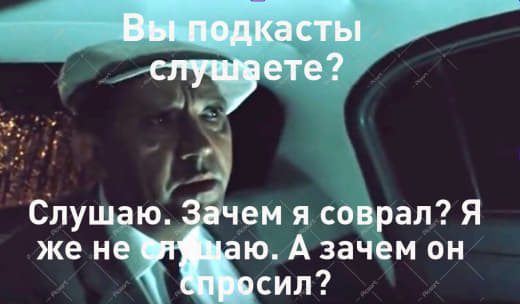
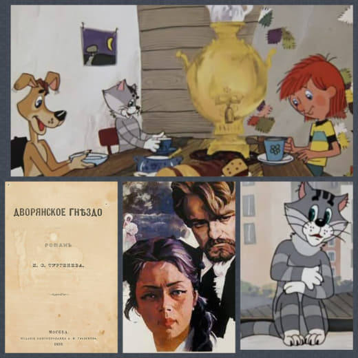
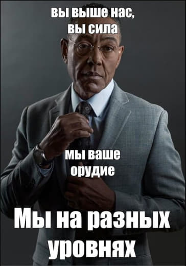

# Последние 40 постов на канале

[На главную](./index.html)

### 15 January 2024

#### 09:18

**Бразилия как загробный мир**  
  
💡 Литературе нужна далекая страна, отъезд героя в которую был бы равносилен смерти. Для Кафки и для советских диссидентов это Америка.  
  
Для некоторых европейских писателей в этой роли выступает Бразилия. 🇧🇷  
  
В Бразилию уезжает муж Тэсс из рода д’Эрбервиллей, чтобы разобраться в своих чувствах. Потусторонняя природа этого персонажа подчеркивается и его именем — Энджел. Энджел вернулся, но роман все равно окончился трагедией.  
  
Из трех самых ходовых «гетеронимов» (вымышленных альтернативных личностей-авторов) португальского поэта Фернандо Пессоа двое умерли, а третий, Рикардо Рейш, уехал в Бразилию, что, как мы понимаем, то же самое, что умереть.  
  
Позднее Жозе Сарамаго напишет роман «Последний год жизни Рикардо Рейша», где гетероним вернется в Лиссабон. Но ненадолго.  
  
Так что Бразилия — это загробный мир, из которого возвращаются. Но счастья эти возвращения все равно не приносят.  
  

> Борис Орехов

### 18 January 2024

#### 10:38

💡 Нина Берберова в воспоминаниях ужасно несправедлива к Бунину. Она рассказывает о конце многолетней дружбы в таком эпизоде:  
  
Я вошла в переднюю. Посреди передней стоял полный до краев ночной горшок, Бунин, видимо, выставил его со злости на кого-то, кто его не вынес вовремя. Сидел он за столом в кухне, а с ним сидел некто Клягин, состоятельный человек, владелец огромного отеля около площади Этуаль. Клягин только что был выпущен из тюрьмы, где отбывал наказание за сотрудничество с немцами. Он не то писал, не то уже издал книгу о своем детстве (кажется, он был сибиряк), и теперь они оба сидели и говорили друг другу, как прекрасно они оба пишут.
  
Безотносительно к тому, насколько это правдиво исторически, посмотрим, как текстуально Берберова внушает читателю неприязнь к Бунину. Тут и плоды жизнедеятельности, и злость, и братание с коллаборантом. Конечно, все это неаппетитно. А если освободиться от этого писательского морока, который Берберова, конечно, умеет искусно наводить, то что тут? Обычная человеческая старческая слабость. Ничего нет плохого в том, что два немолодых человека морально поддерживают друг друга. Имеет пожилой человек (Бунину тут под 80) право на слабость? Всякий хотел бы иметь.  

> Борис Орехов

### 20 January 2024

#### 10:43

💡 Сейчас некоторые смотрят фильмы только чтобы понимать основанные на них мемы. Онегин в той же степени интересовался латынью, ориентируясь на «мемы» своего времени: «чтоб эпиграфы разбирать», то есть «понимать античные надписи на памятниках, зданиях и гробницах» [🔄](stickers/AnimatedSticker (2).tgs)  

> Борис Орехов

### 21 January 2024

#### 13:02

🎙 Эфир на «Маяке». Говорим о том, может ли литературное произведение [📖](stickers/sticker (3).webp) провалиться, чтобы потом обрести заслуженную славу. Как это соотносится с экономикой литературы XIX века, семантическим насыщением формой, скукой и новаторством.  
  
Можно посмотреть видео  
[🌐 в VK](https://vk.com/video-35744422_456257176)  
[📝 в Дзене](https://dzen.ru/video/watch/65a90abb1312c72068d92bce)  
[🌀 на платформе smotrim](https://smotrim.ru/video/2746226)

> Борис Орехов

### 22 January 2024

#### 11:23

💡В одном из стихотворений Пушкина лирический герой видит засохший цветок и задается вопросами о его прошлом:  
  
Где цвел? когда? какой весною?  
И долго ль цвел? и сорван кем,  
Чужой, знакомой ли рукою?  
И положен сюда зачем? 🌸 
  
В русской поэзии существуют «сиквелы» к этому тексту, например, у А. И. Одоевского, в одном из стихотворений которого цветок оказывается сорванным с могилы возлюбленной Петрарки:  
  

> Одну лишь ветку ты хранил  
> С могилы Лауры: — полный чувства дружного,  
> И ту со мною разделил!

Если попросить искусственный интеллект описать прошлое пушкинского цветка 🌸, получим историю в сентиментальном духе:  
  
В тайных часах, где лес шумит густой,  
Рос цветок редкий, ветром колышимый.  
Там в объятиях весеннего ветра  
Он встретил нежность, взлелеянную летом.  
Ласково взята рука неведомая,  
Сорвала цветок, создавая загадку.  
Встреча случайная, но судьбою ведомая,  
Он стал символом встречи, сладкой как мед.  
На переплете страниц книжной он спрятан,  
Свидетель чувств, что были нежны и глубоки.  
И вот его путь привёл на полотно белое,  
Словно капля слёз, он стал символом чувств.  
Теперь забытый, безуханный в книге,  
Цветок хранит тайну своей встречи.  
Он вянет медленно, как дни теченье,  
Но в сердце поэта живет вечно, велик.  

> Zhenya Potapova

### 25 January 2024

#### 09:58

**Киноассоциации у Мураками**  
  
💡

> — Думай, что жизнь — коробка с печеньем.  
> Я несколько раз кивнул — а затем посмотрел в лицо Мидори.  
> — Наверное, у меня не все в порядке с головой, но иногда я тебя совершенно не понимаю.  
> — В коробке с печеньем есть печенюшки любимые, и не очень. Съешь первым делом самые вкусные — останутся лишь те, что особо не любишь. Когда мне горько, я всегда думаю об этой коробке. Потерпишь сейчас — проще будет потом. Вот и выходит, что жизнь — коробка с печеньем.

  
(«Норвежский лес»)  
  
Наверное, кто-то вспомнит 🎥 Форреста Гампа и его «жизнь как коробка шоколадных конфет» 🎁, но это поверхностная ассоциация, ведь метафора тут с другой идеей.  

А вот более подходящая параллель:  
  
Я разделяю человечество на две группы: люди, которые стригут ногти сначала на левой руке, и люди, которые стригут ногти сначала на правой руке. Моя теория состоит в том, что люди, стригущие ногти сначала на левой руке, они... они более беззаботные. Они имеют тенденцию наслаждаться жизнью больше, потому что сразу идут к простой задаче, оставляя трудности на потом 
(«Нимфоманка» 🔞, Ларс фон Триер, 2013)  

> Борис Орехов

### 28 January 2024

#### 09:23

💡 Раннее христианство создавало поразительные парадоксы, воплощенные как в идеях (например, триединство бога), так и в риторике. Пламенный Тертуллиан [🔥](video_files/sticker.webm) пишет так (и под его пером это действительно превращается в непогрешимую несомненность):  

> «Сын Божий рождён \[распят\] — это не стыдно, ибо достойно стыда; и умер Сын Божий — это совершенно достоверно, ибо нелепо; и, погребённый, воскрес — это несомненно, ибо невозможно».

  
В «Житии Алексия, человека Божия» главный герой идет туда, где его совершенно точно не узнают, где он сможет остаться инкогнито. Где же это? Разумеется, в доме его родителей:  

> «Сойдя с корабля, он сказал: “Благословен Господь Бог мой! Не буду в тягость никому: войду в дом отца моего, как будто я там неизвестен”».

И все так и было, он прожил там неузнанным семнадцать лет. [⏳](stickers/AnimatedSticker (6).tgs)  

> Борис Орехов

### 30 January 2024

#### 12:10

🎙️ Друзья, вышел первый эпизод подкаста «Некраткие содержания». Он посвящен Тютчеву и Фету. Эти поэты похожи или все-таки нет?  
  
Послушать можно в  
[🎙️ Mave](https://nonbrevia.mave.digital/ep-2)  

[🎵 Яндекс.Музыке](https://music.yandex.ru/album/28385653/track/121848377)  

🗣 [Zvuk](https://zvuk.com/episode/136422809)  

[🌐 VK](https://vk.com/video-222396379_456239022)  

🌐 на [Youtube](https://www.youtube.com/watch?v=4MiSxGjzEog)  

🍏 в [Apple Podcasts](https://podcasts.apple.com/ru/podcast/%D1%82%D1%8E%D1%82%D1%87%D0%B5%D0%B2-%D0%B8-%D1%84%D0%B5%D1%82-%D1%80%D0%B0%D0%B7%D0%B4%D0%B5%D0%BB%D0%B5%D0%BD%D0%B8%D0%B5-%D1%81%D0%B8%D0%B0%D0%BC%D1%81%D0%BA%D0%B8%D1%85-%D0%B1%D0%BB%D0%B8%D0%B7%D0%BD%D0%B5%D1%86%D0%BE%D0%B2/id1718619044?i=1000643478127)  
  
А еще можно прочитать транскрипт эпизода [здесь](https://nevmenandr.github.io/nonbrevia/episode01.html).  
  
Не забудьте поставить лайк эпизоду.  
В нем речь идет про Ежи и Петруччо, ознакомиться с этими персонажами можно [здесь](https://www.youtube.com/watch?v=JtC8HfIA-AM). А [здесь](https://nevmenandr.github.io/tiutchev-kandisky/) посмотреть иллюстрации к стихам Тютчева от ИИ.

> Борис Орехов

### 31 January 2024

#### 09:49

В «Лотте в Веймаре» господин Ример пытается описать свои впечатления от поэзии Гёте:  
  

> В них нет ни помпезности, ни высокопарности, ничего от внешней приподнятости, — хотя внутреннее все удивительно возвышенно, и всякий иной стиль изложения, в частности приподнятый, по сравнению с этим стилем кажется плоским, — ничего от торжественности и проповеднического тона, ничего от ходульности и чрезмерности; без огненных бурь и громогласных страстей, в тихом, легком журчании здесь присутствует божество. Можно было бы говорить о трезвости, о приглаженной красивости, если позабыть о том, что его речь тяготеет к крайностям. И все же она избирает серединный путь спокойно, с изящной простотой.
  
Гаспаров описывал такое как «золото середины» для Горация. В этом же ряду находится Мустай Карим. [Почитайте про него статью](https://godliteratury.ru/articles/2019/10/18/mustay-karim-poyeziya-dlya-zhizni), рассказывающую о месте, времени и стиле башкирского поэта. [♾](stickers/AnimatedSticker (10).tgs)  

> Борис Орехов

### 1 February 2024

#### 15:30

Эфир на «Маяке». Говорим о том, как писатель может отомстить обидчику в романе.  
  
[🌐 https://vk.com/video-35744422\_456257196](https://vk.com/video-35744422_456257196)  

[🌀 https://smotrim.ru/video/2753573](https://smotrim.ru/video/2753573)

> Борис Орехов

### 3 February 2024

#### 09:26

💡 Сходства в юморе можно найти пронизывающими границы времени и культуры. 🌈 
  
В «Вине мертвецов» Ромена Гари:  
  
> — Да я и так вот-вот Богу душу отдам!  
> — На кой она ему сдалась! — усмехнулся верзила.

...и недоумение нашего современника, которому объясняют особенности среднеазиатских суеверий. 🤯  

> Борис Орехов

### 5 February 2024

#### 10:44

«Извини, — сказал он. — Я не столько филолог, сколько педант». 👓
  
_Вернер М._ Над обрывом. Пер с нем. С. Шлапоберской. М.: Текст, 2006. С. 128. 📖

> Борис Орехов

### 6 February 2024

#### 12:31

🎙 В эфире второй эпизод подкаста Некраткие содержания. Он посвящен Слову о полку Игореве. Послушать можно на [Mave](https://nonbrevia.mave.digital/ep-3), в 

[VK](https://vk.com/video-222396379_456239023), на [Youtube](https://www.youtube.com/watch?v=VGA2RVgEn8I), на [Яндекс.Музыке](https://music.yandex.ru/album/28385653/track/122088412) и в [Apple Podcasts](https://podcasts.apple.com/ru/podcast/%D0%BD%D0%B8-%D1%81%D0%BB%D0%BE%D0%B2%D0%B0-%D0%BE-%D0%BF%D0%BE%D0%BB%D0%BA%D1%83-%D0%B8%D0%B3%D0%BE%D1%80%D0%B5%D0%B2%D0%B5/id1718619044?i=1000644307414).  
  
  
А еще почитать [транскрипт](https://nevmenandr.github.io/nonbrevia/episode02.html) эпизода

> Борис Орехов

### 9 February 2024

#### 09:11

Если вы вдруг еще не смотрите [🌐](stickers/AnimatedSticker (8).tgs) [YouTube-канал](https://www.youtube.com/@user-je1oz9mc9j/videos) и не читаете в [🚀](stickers/AnimatedSticker (13).tgs) [Телеграме](https://t.me/echoporusski) «Говорим по-русски», то мы рекомендуем подписаться. Особенно завлекательные интересенейшие интервью с экспертами.  
  
Например, [🎞](video_files/sticker (1).webm) [последний ролик](https://www.youtube.com/watch?v=uMG271xSf40) — с Алексеем Шмелевым  
✏️ 00:26 о слове "мир", его индоевропейских корнях и значении в церковнославянском языке  

✏️ 10:17 о влиянии церковнославянского языка на понимание мира и смирения  

✏️ 12:07 о значениях и истории слова "смирение"  

✏️ 20:47 об употреблении слова "смирение" в современном русском языке

> Борис Орехов

### 10 February 2024

#### 10:29
 

💡 «Звездные войны» популяризировали идею, что в холодную погоду можно спрятаться и выжить [в туше животного](https://www.youtube.com/watch?v=CXmp1hLK0tY), как Люк Скайуокер внутри таунтауна. ⭐️
  
А в литературе это было в «Моби Дике» Мелвилла, 🐳 фиксирующем множество мифов западного мира:  

> «французские солдаты во время русской компании превращали в палатки туши павших лошадей, забираясь к ним в брюхо».

> Борис Орехов

### 12 February 2024

#### 10:09

Что общего у истории про троих из Простоквашино и «Дворянского гнезда» Тургенева? Вообще-то большая часть экспозиции: разочаровавшийся мужчина переезжает из города в (почти) уединенный дом на селе, налаживает там отношения с местными и, возможно, находит что-то главное в своей жизни.  
  
Но внимательный читатель знает: объединяет эти тексты кот Матроска (Матроскин):  
  
>...а кот Матрос мурлыкал в широких креслах возле клубка с чулком, продолговатое пламя лампадки чуть-чуть трогалось и шевелилось перед иконой; в соседней комнатке, за дверью, стояла Настасья Карповна и тоже украдкой утирала себе глаза свернутым в клубочек клетчатым носовым платком. 🐈  
  

> Борис Орехов

### 13 February 2024

#### 11:48

Новый выпуск подкаста. Тема: усталость от чтения.  
  
На YouTube: [https://www.youtube.com/watch?v=44c6INmlNmU](https://www.youtube.com/watch?v=44c6INmlNmU)  

Транскрипт: [https://nevmenandr.github.io/nonbrevia/episode03.html](https://nevmenandr.github.io/nonbrevia/episode03.html)

> Борис Орехов

#### 13:02
 

Новый эпизод подкаста, на этот раз про усталость от чтения.  
[https://www.youtube.com/watch?v=44c6INmlNmU](https://www.youtube.com/watch?v=44c6INmlNmU)  

> Борис Орехов

### 14 February 2024

#### 10:20
 

💡 Руссо в «Исповеди»: «Говорят, провансальцы мстят своим врагам, складывая про них песенки». [🎼](stickers/AnimatedSticker (15).tgs)  
  
Пелевин тоже отыгрывался на своих обидчиках в романах. Одного из своих непримиримых критиков Павла Басинского он превратил в персонажа Бесинского. Сделать из живого человека персонажа — это для автора означает получить над ним неограниченную власть.  
  
Слово всегда было грозным оружием мести. В древней ирландской повести о народном герое Кухулине его преследует враждебно настроенный заклинатель:  
  
— Одолжи мне твое копье, о Кухулин, — сказал заклинатель.  

— Клянусь клятвой моего народа, — отвечал Кухулин. — у тебя не больше нужды в нем, чем у меня. Мужи Ирландии нападают сейчас на меня, и я бьюсь с ними.  

— Я сложу злую песню на тебя, если ты не дашь его, — сказал заклинатель.  

— Никогда еще не бывал я проклят и опозорен за отказ в даре или за скупость.  
  
Поэтому Кухулин дарит свое копье заклинателю. Но очень своеобразным способом:  
  
С этими словами Кухулин метнул копье древком вперед, оно пробило голову заклинателя и поразило насмерть еще девять человек, стоящих за ним.  
 

> Борис Орехов

### 15 February 2024

#### 14:06
 

💡 В сериале «Твин Пикс» 🔺 есть обаятельный персонаж — Дама с поленом. Она периодически общается с главными героями и намекает им, что ее полено, в компании с которым дама появляется, в курсе происходящих загадочных событий.  

А вот в «Физиологии Петербурга»:  

> Один мой знакомый рассказывал, что в старые годы он часто видал там одного худого, чахлого старичка, который с видимым усилием приносил под мышкой тяжелое толстое березовое полено, тщательно завернутое в клетчатый бумажный платок; садясь в лодку, он бережно клал его к себе на колени, любовно глядел на него и укутывал заботливо, словно мать ребенка.  
> — Берегите, берегите его, Иван Иванович, — часто, смеясь, говорили старичку молодые чиновники, — неравно простудится наше полено, станет кашлять, спать не даст.  
> — Полноте смеяться, — отвечал старичок, — оно мне и так не дает спать.

  
  
Параллель (в духе «Некратких содержаний») увидел Даниил Скоринкин и подарил нам это наблюдение. А мы в свою очередь дарим вам возможность послушать с Даниилом Андреевичем эпизод 🗣 подкаста, в котором речь идет об университетах — Казанском, Оксфорде и Потсдаме.  
Рекомендуем подписаться на новости этого подкаста, он называется «Лига Айвы» (игра слов с Ivy League), посвящен университетскому пространству и людям в университете.  

[🚀 телеграм-канал](https://t.me/universitates_podcast) подкаста.  

[🌐 сайт](https://universitates.ru/) проекта.  

[🎬 запись](https://youtu.be/PY6rZTU5CZ0) беседы с Даниилом Скоринкиным на Youtube.  

[✏️ транскрипт](https://universitates.ru/ep-02.html) подкаста.

> Борис Орехов

### 18 February 2024

#### 10:01

💡 В «Острове пингвинов» Анатоля Франса пребывающий в загробном мире Вергилий говорит: «Я никогда особенно не верил тому, что сам рассказывал обо всем этом в “Энеиде”. Воспитанный философами и физиками, я предчувствовал, каково истинное положение дел. Жизнь в преисподней чрезвычайно ограниченна; здесь не испытывают ни радости, ни страдания; существуют как бы не существуя. Мертвые обладают здесь только тем бытием, каким их наделяют живые. И все же я предпочел остаться здесь».  
  
В книгах фантаста Лукьяненко о дозорах воплощена концепция реальности как системы слоев (они называются слоями Сумрака), по которым могут путешествовать сильные волшебники (Иные). На шестом слое находится загробный мир, который изображен схожим образом: 🌓
  
— Разве тебе не нравится рай, который ждет Иных после смерти?  
Вместо ответа я нагнулся, сорвал травинку. Сунул ее в рот, прикусил. Травяной сок был горьким… вот только немножко недостаточно горьким. Я прищурился и посмотрел на солнце. Солнце сияло в небе, но его свет не ослеплял. Хлопнул в ладоши — звук был самую малость приглушен. Я вдохнул полной грудью — воздух был свеж… и все же в нем чего-то не хватало. Оставалась легкая затхлость, будто в покинутой квартире Саушкина…  
— Здесь все чуть-чуть ненастоящее, — сказал я. — Не хватает жизни. 💀
  
Но в отличие от Вергилия у Франса, обитатели такого неполноценного мира страдают и жаждут избавления от недосуществования. 💐
 

> Борис Орехов

### 20 February 2024

#### 11:44

📢 Новый подкаст. Сегодня про слепого (или нет?) старца (или нет?) Гомера.  
Как обычно, есть ссылки для прослушивания [https://nonbrevia.mave.digital/ep-5](https://nonbrevia.mave.digital/ep-5)  
[https://www.youtube.com/watch?v=KF3wCo-WvMk](https://www.youtube.com/watch?v=KF3wCo-WvMk)  
и транскрипт эпизода: [https://nevmenandr.github.io/nonbrevia/episode04.html](https://nevmenandr.github.io/nonbrevia/episode04.html)

> Борис Орехов

### 21 February 2024

#### 10:01

💡 В Кондуите и Швамбрании Льва Кассиля повествователь и его друг Гришка решают прокатиться на «знаменитом иноходце Гамбите, лучшем рысаке в городе» по кличке Гамбит. Но поездка пошла не по плану: 🫏  
  
— Гришка, а как он вообще останавливается?..  

Тут, кажется, Гришка понял, в чем дело.  

— Тпру, стой! — что есть силы закричал он, и мы стали тянуть вожжи в четыре руки.  

Но могучий иноходец не обращал внимания на наши крики и на рывки вожжей, шел все быстрее и быстрее, таща нас по пустым улицам.  

— Не понимает, наверно, по-нашему! — с ужасом сказал Гришка. — А кто знает, как будет «тпру» по-немецки! Мы это не учили.  
  
Можно воспринимать эту сцену как перевертыш гоголевской птицы-тройки. Все ускоряющие ход лошади даны через осмысление национальных мотивов: немецкий иноходец у Кассиля подмигивает необгонимой тройке Руси, противопоставленной у Гоголя другим нациям. 🐴  
  
«Русь, куда ж несешься ты? дай ответ. Не дает ответа. Чудным звоном заливается колокольчик; гремит и становится ветром разорванный в куски воздух; летит мимо все, что ни есть на земли, и, косясь, постораниваются и дают ей дорогу другие народы и государства...»  

> Борис Орехов

### 24 February 2024

#### 10:02

💡 Для писателей важна метафора языка. Они внимательны к языку. А конкретные языки в их оптике становятся частью парадоксов и игры ума.  
  
У Набокова в романе «Пнин» в болезненном переживании автором собственной ностальгии, наложившейся на самоубеждение в том, что русская культура окончилась с революцией: «неизменно ложился некий налет тайны и блеска, величественная фигура Тимофея Пнина, ученого и джентльмена, преподающего этот в сущности мертвый язык в знаменитом Уэйндельском университете».  
  
Пнин преподавал русский. Русский назван мертвым языком.  
  
У Олдоса Хаксли в «Дивном новом мире»: «Полагаю, вам известно, что такое “польский”? — Это язык, мертвый язык». 🇮🇩  
  
Кстати, у Александра Чудакова в «Ложится мгла на старые ступени»: «Я не брезглив, — говорил он, заворачивая, однако, нижнюю губу, — перевожу даже с польского». [📖](stickers/sticker (3).webp)  
  

> Борис Орехов

### 27 February 2024

#### 11:05

Новый подкаст. Сегодня про Набокова.  

Слушать: 🎧 [https://nonbrevia.mave.digital/ep-6](https://nonbrevia.mave.digital/ep-6)  

Читать: [https://nevmenandr.github.io/nonbrevia/episode05.html](https://nevmenandr.github.io/nonbrevia/episode05.html)  

> Борис Орехов

### 28 February 2024

#### 10:01

💡 Для наших современников «Черное зеркало» — это сериал, художественное осмысление неукротимой силы технологий. ⚫️ 
  
Но в «Иностранной литературе» в №3 за 1992 год была опубликована готическая новелла Жана Рэя в переводе известного литературоведа Сергея Зенкина, которая носит то же название. В новелле черное зеркало — это черный камень, посредством которого вызывали духов. Технологии, подсвеченные светом мистики, вытесняют сверхъестественных существ. Этот процесс отражен в «Американских богах» Нила Геймана, где Иштар, Один, Кали, Тот, Анубис, Гор теряют свою силу, уступая место интернету и масс-медиа. [⌨️](stickers/AnimatedSticker (22).tgs)  
 

> Борис Орехов

### 1 March 2024

#### 10:02

💡 В «Блеске и нищете куртизанок»: «Маркиза невольным жестом выдала свое недовольство, почувствовав, что Люсьен, как говорят англичане, срезал ее своей прямотой».  
  
Зацепившись за это слово, можно увидеть литературное родство Люсьена с Глебом Капустиным из рассказа Шукшина: «И как-то так повелось, что, когда знатные приезжали в деревню на побывку, когда к знатному земляку в избу набивался вечером народ — слушали какие-нибудь дивные истории или сами рассказывали про себя, если земляк интересовался, — тогда-то Глеб Капустин приходил и срезал знатного гостя». 🙂

> Борис Орехов

#### 23:10

Если вы еще не слушали 🎙 второй эпизод подкаста Некраткие содержания, то сейчас самое время. Он посвящен Слову о полку Игореве. Послушать можно на [Mave](https://nonbrevia.mave.digital/ep-3), в [VK](https://vk.com/video-222396379_456239023), на [Youtube](https://www.youtube.com/watch?v=VGA2RVgEn8I), на [Яндекс.Музыке](https://music.yandex.ru/album/28385653/track/122088412) и в [Apple Podcasts](https://podcasts.apple.com/ru/podcast/%D0%BD%D0%B8-%D1%81%D0%BB%D0%BE%D0%B2%D0%B0-%D0%BE-%D0%BF%D0%BE%D0%BB%D0%BA%D1%83-%D0%B8%D0%B3%D0%BE%D1%80%D0%B5%D0%B2%D0%B5/id1718619044?i=1000644307414).  
  
  
А еще почитать [транскрипт](https://nevmenandr.github.io/nonbrevia/episode02.html) эпизода

> Борис Орехов

### 4 March 2024

#### 10:02

💡 В романе «Околоноля» Натана Дубовицкого: «Настоящая власть не применима, как атомная бомба». ☢️

Близкая идея о природе власти у Фрэнка Герберта в «Дюне»: «Кто может уничтожить некую вещь, тот её и контролирует по-настоящему». То есть власть (или контроль) — это всегда потенциальность. Если применить атомную бомбу и уничтожить вещь, то контролировать будет уже нечего и властвовать не над чем. ⛔️

> Борис Орехов

### 5 March 2024

#### 12:17

🎙 новый эпизод подкаста Некраткие содержания.  

Сегодня о том, что хотел сказать автор.🎙

Транскрипт эпизода и ссылки для прослушивания: [nevmenandr.github.io/nonbrevia/episode06.html](nevmenandr.github.io/nonbrevia/episode06.html)  
  
[https://nonbrevia.mave.digital/ep-7](https://nonbrevia.mave.digital/ep-7)  
  
В выпусках подкаста будет перерыв. Продолжим через несколько недель. Всего выйдет 10 эпизодов.  

Посты на канале будут выходить регулярно.

> Борис Орехов

### 7 March 2024

#### 10:02

💡 В «Обрыве» И. А. Гончарова: «Мы не равны: вы выше нас, вы сила, мы ваше орудие».  

> Борис Орехов

### 8 March 2024

#### 09:45

В выпусках подкаста [🎙](video_files/sticker (4).webm) будет перерыв. Пока можно послушать и переслушать старые эпизоды.  
  
Например, про Набокова: [🎙](stickers/AnimatedSticker (12).tgs) [https://nevmenandr.github.io/nonbrevia/episode05.html](https://nevmenandr.github.io/nonbrevia/episode05.html)  
  
[https://nonbrevia.mave.digital/ep-6](https://nonbrevia.mave.digital/ep-6)  
[https://youtu.be/25PQdk6vFrs](https://youtu.be/25PQdk6vFrs)

> Борис Орехов

### 9 March 2024

#### 08:03
 

В выпусках подкаста 🎙 будет перерыв. Пока можно послушать и переслушать старые эпизоды.  
  
Например, про Гомера: [https://nevmenandr.github.io/nonbrevia/episode04.html](https://nevmenandr.github.io/nonbrevia/episode04.html)  

[https://nonbrevia.mave.digital/ep-5](https://nonbrevia.mave.digital/ep-5)  

[https://www.youtube.com/watch?v=KF3wCo-WvMk](https://www.youtube.com/watch?v=KF3wCo-WvMk)

> Борис Орехов

### 10 March 2024

#### 10:01

💡 Прототипом главной героини «Женского портрета» выступила умершая к тому времени кузина Джеймса, у Гарди так же — там импульсом для «Джуда незаметного» послужила рано умершая кузина писателя Трайфена Спаркс. Видимо, это не случайно: люди из хороших семей в викторианскую эпоху мало с кем общались вне своей фамилии. Ну и слабость медицины, конечно. [👗](stickers/sticker (20).webp)  
  

> Борис Орехов

### 13 March 2024

#### 10:01

Некраткие содержания

💡 Писатели не могут не рефлексировать над отношениями XIX и XX века. 🕰
  
В «Даре» Набокова: «Девятнадцатый век необыкновенно любил выставлять свои богатства, пышное и безвкусное приданое, которое нынешний промотал». [🕰](stickers/sticker (22).webp)  
  
У Ромена Гари в «Дальше ваш билет недействителен»: «Двадцатый век не подготовил двадцать первый: он растратил свои силы, удовлетворяя девятнадцатый».  
  
Можно поверить и в сознательную для Гари полемику с предшественником. «Дальше ваш билет недействителен» — текст с отчетливым набоковским привкусом, отсылающий скорее к «Лолите» (рассказчик так же сосредоточен на своей сексуальной девиации), чем к «Дару», но ведь именно в «Даре» впервые озвучен сюжет «Лолиты».  
  
Об этом, кстати, в набоковском выпуске подкаста некратких. Послушать можно много где. Например, здесь: [https://nonbrevia.mave.digital/ep-6](https://nonbrevia.mave.digital/ep-6)  

> Борис Орехов

### 16 March 2024

#### 10:02

 

💡 У Александра Чудакова в «Ложится мгла на старые ступени»: «Тот, кто разговаривает с природой, непобедим». Можно услышать в этом экологическую повестку, как в фильме «Аватар», где непобедимость показана в прямом смысле, как результат сражения, обязательного для голливудского блокбастера. И разговор с природой там показан тоже в прямом смысле. [🍁](stickers/sticker (23).webp)  
  

> Борис Орехов

### 19 March 2024

#### 10:01

💡 Как Берберова делает свои воспоминания литературными:  
  
«Она взяла меня за руку и представила Ахматовой:  

— Вот это та девочка... Пишет стихи. (“Тоже” пишет стихи?)  

Ахматова протянула мне худую руку.  

— Очень приятно.  

Это “очень приятно” мне показалось таким светским, обращенным ко мне, словно ко взрослой, пожатие руки оставило впечатление чего-то узкого и прохладного в моей ладони, я хотела убежать — от смущения, волнения, сознания своего ничтожества. Но Т. В. держала меня крепко». 📖
  
Ситуация знакомства с выдающимся поэтом старшего поколения. Стартовые позиции схожие с тем, о чем вспоминает Пушкин: «Не помню, как я кончил свое чтение; не помню, куда убежал. Державин был в восхищении; он меня требовал, хотел меня обнять… Меня искали, но не нашли». 📖 
  
Отсылка узнаваема. Но результат различен: юной Берберовой не дали убежать, и поэтому мемуарист опровергает сам себя: она не Пушкин, а Ахматова не Державин, сюжет не должен повторяться в точности. 📖

> Борис Орехов

### 22 March 2024

#### 10:02

💡 В «Милом друге» Мопассана: «В конечном счете все равно — смерть. Я вижу ее теперь так близко, что часто мне хочется протянуть руку и оттолкнуть ее». ☠️  
  
Такое помещение смерти в окружающем пространстве и увязывание ее с рукой отзывается в текстах другого писателя, Карлоса Кастанеды: «Смерть — наш вечный попутчик. Она всегда находится слева от нас на расстоянии вытянутой руки. Когда ты в нетерпении или раздражен — оглянись налево и спроси совета у своей смерти». [🥺](stickers/sticker (27).webp)  

> Борис Орехов

### 25 March 2024

#### 10:02

 
💡 В «Острове пингвинов» Анатоля Франса вдруг предсказывается появление важной для современного социального знания экономической истории: «Настоящий труд мой, следует признать, относится к истории в старом понимании этого слова — то есть в известной последовательности излагает события, о коих сохранилась память, и указывает по мере возможности их причины и следствия, — так что принадлежит скорее к области искусства, чем науки. Существует мнение, что подобный метод перестал уже удовлетворять умы, требующие точных знаний, и что древняя Клио, по нынешним временам, попросту болтунья. И, разумеется, когда-нибудь появится история более достоверная, исследующая условия существования, устанавливающая, что производил и потреблял тот или иной народ в ту или иную эпоху в разных областях своей деятельности. Такая история будет уже не искусством, а наукой, соблюдая точность, старой истории недоступную. Но для этого необходимо множество статистических данных, коими народы — и, в частности, пингвины — до сих пор не располагают». 💰 
  
Кстати, об экономической истории есть интереснейший [канал](https://t.me/economhistory) в Телеграме.  

> Борис Орехов

### 28 March 2024

#### 10:02

💡 В романе «Пушкин» Тынянова: «Она любила в театре всё, кроме сцены».  
  
У режиссера Джеймса Ганна, который сейчас рулит киновселенной DC, в конце 2000-х был минисериал под названием «Порно для всей семьи» (англ. PG Porn), где комически обыгрывались штампы из фильмов для взрослых. И девиз этого проекта основан на той же шутке: «Для тех, кто любит в порно всё… кроме секса». 🔞 

> Борис Орехов

### 31 March 2024

#### 10:02

💡 Пруст пишет: «и, несомненно, в тот момент, еще более исступленно, чем несколько времени тому назад, когда я просил его показать мне дорогу, я продолжаю искать ее, я поворачиваю за угол… но… все это путешествие я совершаю в моем сердце…» [🤎](stickers/sticker (28).webp)  
  
В фильме «Герой» (2002) персонажи [сражаются](https://www.youtube.com/watch?v=pY-Un2p72NQ) в мыслях, не скрещивая оружие в реальности. [https://www.youtube.com/watch?v=pY-Un2p72NQ](https://www.youtube.com/watch?v=pY-Un2p72NQ)

> Борис Орехов

### 3 April 2024

#### 12:41

Дорогие друзья! Наш проект завершен. Спасибо, что были с нами все это время. [Здесь](https://nevmenandr.github.io/nonbrevia/) можно почитать архив записей из этого канала, [здесь](https://nonbrevia.mave.digital/) — послушать выпуски подкаста. Возможно, вас заинтересуют и другие наши инициативы, мы будем рады: [подкаст об университетах](https://universitates.ru/) «Лига Айвы», [проект «Демонтаж красноречия»](https://www.youtube.com/channel/UC9mhPo2m3YxuG1cTE04n-sw) (на YouTube, где скоро будет много интересных видео о литературе), сообщество VK [Calendarium Romanum](https://vk.com/calendariumromanum). На этом канале теперь будут появляться только анонсы других наших проектов и оставшихся (обещанных в трейлере) выпусков подкаста. Ваши авторы некратких содержаний [nevmenandr.github.io](https://nevmenandr.github.io/)

> Борис Орехов

[На главную](./index.html)
